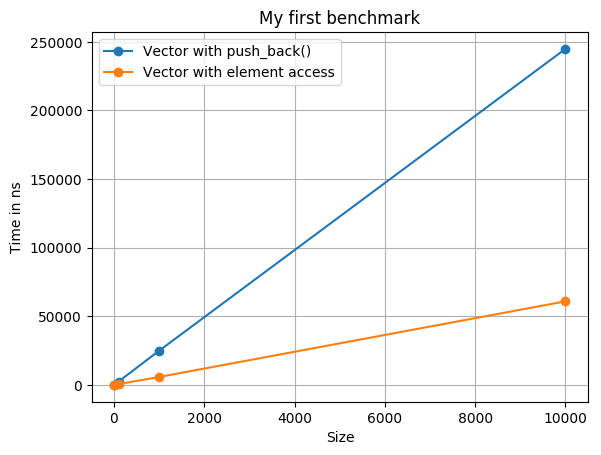

# BenchmarkVisualizer

## Writing a benchmark

Write your benchmark using Google's benchmark library as you are used to do it.
Just two small things have to be changed in order to identify x values and to
group the benchmarks. 

For this purpose the functionality of counters is used. By using

    state.counters["MYCOUNTER"] = 1

you can define a custom counter that does not influence the benchmark's 
functionality in any way.

To identify the x values create any name you like. To identify benchmark
groups use the counter "benchmark_visualizer_group" and use integer values as
group identifiers.

The following example should clarify things:

```c++
static void BM_VectorPush(benchmark::State& state) {
  std::vector<int> vec;
  for (auto _ : state) {
    for (int i = 0; i < state.range(0); ++i) 
      benchmark::DoNotOptimize(vec.push_back(i));
  }

  // Identification of x values
  state.counters["Size"] = state.range(0);

  // Benchmark group
  state.counters["benchmark_visualizer_group"] = 0;
}

static void BM_VectorAccess(benchmark::State& state) {
  std::vector<int> vec(state.range(0));
  for (auto _ : state) {
    for (int i = 0; i < state.range(0); ++i) 
      benchmark::DoNotOptimize(vec[i] = i);
  }

  // Identification of x values
  state.counters["Size"] = state.range(0);

  // Benchmark group
  state.counters["benchmark_visualizer_group"] = 1;
}
```
You might ask now: Why not just identify the benchmarks by its names? Well first
of all, the benchmark library provides results in the form

    name/args

but we could obviously split these. The real reason to avoid splitting of names
is when template functions are involved. Consider the benchmark

```c++
template<typename T>
static void BM_VectorPush(benchmark::State& state) {
  std::vector<T> vec;
  for (auto _ : state) {
    for (int i = 0; i < state.range(0); ++i) 
      benchmark::DoNotOptimize(vec[i] = i);
  }
}
```
Its results will be shown as

    BM_VectorPush<int>/arg

When splitting at ``/`` a comparison between ``BM_VectorPush<int>`` and 
``BM_VectorPush<double>`` is not possible anymore.

## Running the benchmark

Benchmark visualizer uses JSON to access benchmark results. Google's benchmark
library provides ready JSON output by passing the command line option

    --benchmark_format=json

By using

    --benchmark_out=<filename> --benchmark_out_format=json

the output can be saved automatically.

## Visualize!

The ``benchmark_visualizer`` script takes the following arguments

```bash
$ ./benchmark_visualizer --help
usage: benchmark_visualizer [-h] --file FILE [--time_unit {ns,us,ms}]
                            [--title TITLE] [--y_label Y_LABEL]
                            [--x_label X_LABEL] --x_value X_VALUE
                            --output_file FILE [--tick_begin VALUE]
                            [--tick_end VALUE] [--tick_step VALUE]
                            --group_desc DESC

Visualize Google Benchmark.

optional arguments:
      -h, --help            show this help message and exit
      --file FILE, -f FILE  Path to JSON file with benchmark results
      --time_unit {ns,us,ms}, -t {ns,us,ms}
                            Time unit for measured durations
      --title TITLE         Diagram title
      --y_label Y_LABEL     Lable on the y axis
      --x_label X_LABEL     Label on the x axis
      --x_value X_VALUE, -x X_VALUE
                            Name of the counter that stores the x value
      --output_file FILE, -o FILE
                            Path to file where the image of the diagram will be
                            stored.
      --tick_begin VALUE    Set the begin of the x ticks manually
      --tick_end VALUE      Set the end of the x ticks manually
      --tick_step VALUE     Set the steps of the x ticks manually
      --group_desc DESC, -g DESC
```

The important ones are

  --x_value, -x           Specify the name of the counter that identifies the x valued
  --file, -f              Specify the file that contains the benchmark results as JSON
  --output_file, -o       Specify the name of the file that contains the benchmark plot
  --group_desc, -g        Names for the benchmark groups using the following pattern:
                            NAME_OF_GROUP_1 NAME_OF_GROUP_2 ...

## Example

Consider the following benchmark names ``benchmark.cc``

```c++
#include <vector>
#include <benchmark/benchmark.h>

static void BM_VectorPush(benchmark::State& state) {
  std::vector<int> vec;
  for (auto _ : state) {
    for (int i = 0; i < state.range(0); ++i) {
      vec.push_back(i);
    }
  }

  // Identification of x values
  state.counters["Size"] = state.range(0);

  // Benchmark group
  state.counters["benchmark_visualizer_group"] = 0;
}

static void BM_VectorAccess(benchmark::State& state) {
  std::vector<int> vec(state.range(0));
  for (auto _ : state) {
    for (int i = 0; i < state.range(0); ++i) {
      vec[i] = i;
    }
  }

  // Identification of x values
  state.counters["Size"] = state.range(0);

  // Benchmark group
  state.counters["benchmark_visualizer_group"] = 1;
}

BENCHMARK(BM_VectorPush)
  ->Arg(10)
  ->Arg(100)
  ->Arg(1000)
  ->Arg(10000);

BENCHMARK(BM_VectorAccess)
  ->Arg(10)
  ->Arg(100)
  ->Arg(1000)
  ->Arg(10000);

BENCHMARK_MAIN();
```

Compile and run it:

  $ clang++ -std=c++11 -lbenchmark benchmark.cc -o benchmark
  $ ./benchmark --benchmark_out=benchmark_results.json --benchmark_out_format=json

Visualize it:

  $ ./benchmark_visualizer --file=benchmark_results.json --x_value=Size --title="My first benchmark"
    --output_file=results.png -g "Vector with push_back()" "Vector with element access"

The result is


